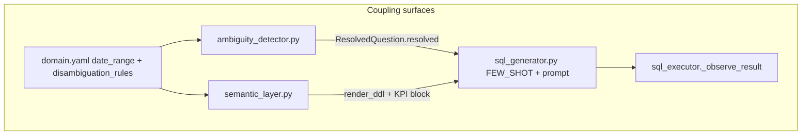

# Expanded remediation strategy

Five priorities, ordered by **user impact × fix leverage × eval signal quality**. Each section covers the failure mode, where it lives in the architecture, concrete approaches (with tradeoffs), risks, verification strategy, and how it interacts with the other four.

The guiding principle: **fix grounding and gates before tuning generation; fix generation before polishing narrative.** A perfect synthesis prompt cannot fix SQL that queries an empty time window, and a perfect classifier cannot fix an eval gate that marks failed executions as pass.

---

## Priority 1 — Temporal grounding in disambiguation

### What broke (evidence)

Case 11 is the clearest failure in the eval: structural pass, execution fail, no narrative.

| Signal | Value |
|--------|-------|
| `ambiguity_pass` | ✓ (rule fired) |
| `sql_pass` | ✓ (`where`, `date` present) |
| `execution.success` | ✗ |
| `failure_reason` | `max steps reached without successful result` |
| `steps_taken` | 4 (ReAct ceiling) |

Root chain:

1. `AMBIGUITY_TRIGGERS["recent"]` → axis `"recent without explicit time window"`
2. `domain.yaml` rule: `"default to last 30 days using date column"`
3. SQL generator interprets this as `strftime('%Y-%m-%d', 'now', '-30 days')`
4. Dataset `date_range`: **2024-09-21 → 2024-11-20**; eval run: **2026-05-27**
5. Query returns **0 rows** → observer REFINE → refinement keeps `now`-relative logic → 4 steps exhausted

This is not a model quality problem. It is a **contract mismatch** between disambiguation semantics (calendar-relative) and dataset semantics (static historical snapshot).

### Architectural seams touched



| Surface | From `known-coupling-surfaces.md` | Role here |
|---------|-----------------------------------|-----------|
| Ambiguity axis strings | `AMBIGUITY_TRIGGERS` ↔ `disambiguation_rules.when` | Rule fires correctly; **apply text is underspecified** |
| `date_range` in domain.yaml | Semantic layer ↔ SQL prompts | Exists but **not consumed** by disambiguation or ReAct hints |
| ReAct observer hints | `_observe_result` 0-row message | Mentions spelling/date filters, **not dataset anchor** |
| Eval case 11 | `check_ambiguity(11)` only checks string mutation | **Does not require rows > 0** |

### Approach options (ranked)

#### Option A — Dataset-anchored disambiguation (recommended)

Change the **rule output**, not the LLM, so temporal qualifiers resolve against `date_range.end` instead of wall clock.

**Mechanism:** When `"recent without explicit time window"` fires, append an absolute window to `resolved`:

```
What were the recent sales? — default to last 30 days: date >= '2024-10-21' AND date <= '2024-11-20'
```

Compute `end - 30 days` from `domain.yaml` `date_range.end` at load time in `SemanticLayer` or `ambiguity_detector`.

| Pros | Cons |
|------|------|
| Deterministic; no extra LLM call | Requires plumbing `date_range` into detector |
| Fixes case 11 at source | "Recent" semantics change for live DBs (need config flag later) |
| Aligns with domain.yaml note: *"Dataset spans 60 days"* | Must update `domain.yaml` `apply` text or generate dynamically |

**Touch points:** `domain.yaml`, `ambiguity_detector.py`, possibly `semantic_layer.py` to expose `get_date_anchor()`.

#### Option B — ReAct observer enrichment

Extend `_observe_result` 0-row message with dataset bounds:

> *"Query returned 0 rows. Dataset covers 2024-09-21 to 2024-11-20. If using relative dates (now, last N days), anchor to dataset end instead."*

| Pros | Cons |
|------|------|
| Minimal code; no disambiguation change | **Non-deterministic** — depends on model following hint |
| Helps other relative-date bugs | Burns 1–3 ReAct steps anyway |
| Complements Option A | Does not fix eval case 11 alone reliably |

**Best as:** safety net after Option A, not primary fix.

#### Option C — SQL post-processor for `now` patterns

Regex-detect `strftime(..., 'now'` in generated SQL; rewrite using `date_range.end`.

| Pros | Cons |
|------|------|
| Catches LLM ignoring resolved qualifier | Fragile; SQL dialect-specific |
| Works even without ambiguity | Fights the model; hard to maintain |

**Best as:** last resort for demo hardening.

### Recommended strategy

**Phase 1 (1–2 hours):** Option A — anchor "recent" / "last 30 days" to `date_range.end`.

**Phase 2 (30 min):** Option B — inject `date_range` into 0-row observer message from `SemanticLayer`.

**Phase 3 (eval):** Add execution assertion for case 11 (see Priority 4).

Do **not** start with prompt-only changes to `sql_generator` — the disambiguation rule is the authoritative business contract; the model already receives `resolved_question`.

### Risks

| Risk | Severity | Mitigation |
|------|----------|------------|
| Hardcoding 2024 dates breaks "live" deployment story | Medium | Document as demo scope; later: `reference_date` env var |
| `"last month"` rule also uses October 2024 — inconsistent if "recent" becomes rolling from end | Low | Audit all time rules together; single `TemporalContext` helper |
| Resolved string becomes long/noisy for UI | Low | Keep human-readable suffix; interpretations list already surfaces rules |
| Tests only mock disambiguation, never execute SQL | **High** | Add integration test: case 11 → `execution.success` and `row_count > 0` |

### Success criteria (rigorous)

- Case 11: `execution.success == true`, `steps_taken == 1`, `failure_reason == null`
- Generated SQL contains `date >= '2024-10-21'` (or equivalent anchored window), **not** `'now'`
- Manual query *"recent sales"* returns rows in UI
- No regression on case 10 (ambiguity still fires for "popular")
- `test_ambiguity_detector.py` extended: resolved string includes anchored dates when `recent` trigger fires

### Rationale for #1 ranking

- **Only priority that causes total pipeline failure** (no data, no narrative) while eval marks PASS
- Fix is **small, deterministic, high confidence**
- Unblocks trust in the ambiguity layer — without this, cases 10–11 teach opposite lessons (10 works, 11 fails for same subsystem)

---

## Priority 2 — Returns semantic guard

### What broke (evidence)

Case 12: `total < 0` absent from SQL; execution still succeeds; judge scores 5/5.

| Layer | Outcome |
|-------|---------|
| Structural eval | ✗ (correct) |
| Execution | ✓ (wrong semantics) |
| Judge | ✓ (false negative) |
| User | Gets "top products" narrative, not "most returns" |

The schema **does** document returns:

- `domain.yaml`: *"Negative for returns/refunds (38 rows in dataset)"*
- KPI note: *"Add WHERE total > 0 to exclude returns"*
- `db/main.py` DDL comments mirror this

The model ignored negative-total semantics despite full schema injection. Substring check caught it; **nothing in the runtime pipeline did**.

### Architectural seams touched

```
domain.yaml (column.total.description, kpis.note)
    → semantic_layer.render_ddl() + get_kpis()
    → sql_generator.build_sql_prompt()
    → LLM → sql_executor (no semantic validation)
    → result_synthesizer (no sign check)
    → eval judge (no business rule awareness)
```

| Surface | Issue |
|---------|-------|
| Eval clause vocabulary | `total < 0` is brittle (`total<0`, `total <= -1`, `having sum(total) < 0` all miss) |
| FEW_SHOT_EXAMPLES | No returns example in any `QueryClass` bucket |
| ReAct observer | No rule for "returns question but all totals non-negative" |
| KPI definitions | Mention returns exclusion for revenue, not inclusion for returns queries |

### Approach options

#### Option A — Targeted few-shot addition (low cost, medium reliability)

Add to `FEW_SHOT_EXAMPLES[QueryClass.AGGREGATION]`:

```sql
-- Q: Which products have the most returns?
SELECT product_name, SUM(quantity) AS return_units
FROM sales
WHERE total < 0
GROUP BY product_name
ORDER BY return_units ASC
LIMIT 10;
```

| Pros | Cons |
|------|------|
| One-file change | Model may still skip filter on paraphrase |
| Aligns with existing few-shot pattern | Doesn't help "refunds" / "negative sales" synonyms |
| Likely fixes eval case verbatim | 38 rows — edge case metric may confuse ranking |

#### Option B — Keyword-triggered SQL constraint injection (recommended core)

Extend `sql_generator.build_sql_prompt` or a thin pre-check:

```python
RETURNS_TRIGGERS = ("return", "refund", "negative")
if any(t in question.lower() for t in RETURNS_TRIGGERS):
    constraint = "-- REQUIRED: filter return rows with WHERE total < 0"
```

Inject into prompt above the question line.

| Pros | Cons |
|------|------|
| Deterministic guardrail | Another keyword map (like classifier) |
| Works across paraphrases if triggers cover synonyms | Maintenance of trigger list |
| Complements few-shot | Could misfire on "return customers" (unlikely in POS domain) |

#### Option C — Post-generation SQL lint (strongest runtime gate)

After `extract_sql`, before ReAct:

```python
def lint_returns_filter(question: str, sql: str) -> str | None:
    if "return" in question.lower() and "total < 0" not in sql.lower():
        return "Missing WHERE total < 0 for returns query"
```

If lint fails → inject into refinement prompt or prepend `WHERE total < 0` with AST-aware edit (risky) or force ReAct with explicit observation.

| Pros | Cons |
|------|------|
| Catches case 12 regardless of model | Auto-prepend is dangerous (may break valid SQL) |
| Eval-independent safety | Lint rules multiply for each domain semantic |
| Fits "output validation" layer (L3) | Needs careful integration with ReAct loop |

**Recommended:** Option A + B together; Option C as optional hard gate if A+B insufficient after re-eval.

#### Option D — Result-level validation in observer

If question mentions returns and `min(total) >= 0` in result sample → REFINE.

| Pros | Cons |
|------|------|
| Validates semantics, not syntax | Requires executing SQL first |
| Catches wrong filter even if clause present but wrong column | Needs aggregate awareness |

**Best as:** complement to B/C.

### Recommended strategy

1. **Few-shot** (Option A) — immediate signal to SQL model
2. **Prompt constraint** (Option B) — when returns triggers fire
3. **Re-eval case 12** — if still failing, add observer check (Option D)
4. **Expand eval** (Priority 4) — `result_assertions` not just clause substrings

Avoid automatic SQL rewriting without parsing — SQLite + LLM output is too messy for naive injection.

### Risks

| Risk | Severity | Mitigation |
|------|----------|------------|
| Overfitting eval case 12 verbatim | Medium | Add second case: *"products with refunds"* with same assertion |
| `SUM(quantity)` vs `COUNT(*)` for returns — eval expects `total < 0` only | Low | Document metric: returns = negative **line totals**; quantity also negative |
| False trigger on unrelated "return" | Low | Require co-occurrence with "product"/"most"/"which" |
| Few-shot bloat in prompt | Low | One example; monitor latency (already ~400–700s) |

### Success criteria

- Case 12: `sql_pass == true`, `total < 0` present (or normalized equivalent in expanded checker)
- Result rows: all sampled `total` values < 0 (or aggregated from negative lines)
- Judge still run — but add **result assertion** so judge 5/5 cannot override structural semantic fail
- New unit test: `test_returns_prompt_injects_constraint` in `test_sql_generator.py`

### Rationale for #2 ranking

- **Known, documented, stable failure** across eval runs (`204618`, `034521`)
- Fix is localized to SQL path; no cross-container changes
- Exposes a **class of eval blind spots** (semantic requirements ≠ substring checks ≠ LLM judge)
- 38-row edge case is exactly the kind of rule-based guard that beats bigger models in production NL2SQL

---

## Priority 3 — Classifier precedence (Case 1)

### What broke (evidence)

*"What is the most bought product on Fridays?"*

| Dimension | Result |
|-----------|--------|
| `class` | `time_filter` |
| `expected_class` | `aggregation` |
| `sql_pass` | ✓ |
| `class_pass` | ✗ |

Cause: `KEYWORD_CLASS_MAP` iteration order — `TIME_FILTER` checked before `AGGREGATION`; `"on friday"` matches before `"most"`.

Irony: the **AGGREGATION few-shot is literally this question**, but the model receives the TIME_FILTER few-shot (busiest hours on weekdays).

### Architectural seams touched

| Surface | From coupling registry |
|---------|------------------------|
| `QueryClass` ↔ `FEW_SHOT_EXAMPLES` ↔ `TEST_CASES.expected_class` | All three must stay aligned |
| Classifier method telemetry | `"heuristic"` vs `"llm"` — eval doesn't record this |
| `ResolvedQuestion` → classifier | Classification runs on **resolved** string (includes quantity disambiguation) |

### Approach options

#### Option A — Reconcile eval expectation (fastest, debatable)

Change case 1 `expected_class` to `time_filter`.

| Pros | Cons |
|------|------|
| Zero pipeline change | **Mislabels product intent** — question is aggregation with time filter |
| Matches current behavior | Masks routing bug; few-shot mismatch remains |
| README already notes this | Teaches wrong taxonomy for DIN-SQL decomposition |

**Verdict:** Acceptable for submission doc honesty; **not** acceptable as engineering fix if classifier drives behavior.

#### Option B — Multi-label / scored classification (proper)

Return primary + secondary class, or score all keyword hits:

```python
hits = [(cls, kw) for cls, kws in MAP.items() for kw in kws if kw in q]
# Prefer AGGREGATION when "most|top|sum|count" co-occur with day filter
```

| Pros | Cons |
|------|------|
| Reflects true query shape | API change to `PipelineResult` if exposing multi-class |
| Better few-shot selection | More complex tests |
| Extensible | Overkill if few-shot merge is simpler |

#### Option C — Priority overrides (recommended for demo scope)

After keyword scan, apply override rules:

```python
AGGREGATION_OVERRIDES = ("most", "top", "best", "how many", "total", "average")
if any(w in q for w in AGGREGATION_OVERRIDES):
    return QueryClass.AGGREGATION, "heuristic_override"
```

Or: if **both** TIME_FILTER and AGGREGATION hit, prefer AGGREGATION when ranking/counting verbs present.

| Pros | Cons |
|------|------|
| Small diff in one file | Another layer of heuristics |
| Fixes case 1 and similar (*"top product on Monday"*) | Edge cases: *"what day has the most transactions"* → legitimately time_filter |
| Keeps enum single-valued | Needs explicit test matrix |

#### Option D — LLM classify when multiple keyword classes hit

If >1 class matches → `_llm_classify` instead of first-match-wins.

| Pros | Cons |
|------|------|
| Handles edge cases better | +1 LLM call on ambiguous questions |
| Already have fallback path | Latency (+30–90s per query) |
| | Non-deterministic |

**Recommended:** Option C with a **narrow override table**; defer Option D unless override misfires on manual testing.

#### Option E — Decouple few-shot from single class

When multiple triggers fire, concatenate relevant few-shots (AGG + TIME_FILTER snippets).

| Pros | Cons |
|------|------|
| Case 1 gets both patterns | Longer prompts |
| Reduces misclassification impact | Prompt token cost |

**Best as:** belt-and-suspenders with Option C.

### Recommended strategy

1. Implement **Option C** override: AGGREGATION wins when ranking/count verbs present alongside day-of-week filter
2. Add tests in `test_query_classifier.py` (if missing) or extend existing:
   - *"most bought on Fridays"* → `aggregation`
   - *"busiest day of the week"* → `time_filter` (no override)
   - *"how many transactions on Saturday"* → `time_filter` (case 2 — must not regress)
3. Keep `expected_class="aggregation"` in harness — case 1 becomes true pass
4. Optionally add Option E if re-eval shows SQL regressions

### Risks

| Risk | Severity | Mitigation |
|------|----------|------------|
| Case 2 regression (*"how many ... on Saturday"*) | **High** | Override must require ranking verbs, not bare "how many" |
| *"Which hour on Fridays is busiest"* — time vs agg ambiguous | Medium | Manual test matrix before merge |
| Eval/classifier/heuristic docs drift | Medium | Update README eval table when fixed |
| Fixing class breaks SQL that accidentally worked | Low | Re-run full eval; case 1 SQL should improve or stay same |

### Success criteria

- Case 1: `class_pass == true`, `sql_pass` still true
- Case 2, 3, 8: `class_pass` unchanged
- `cls_method` logged in JSONL (optional improvement for observability)
- No increase in average `steps_taken`

### Rationale for #3 ranking

- **Currently non-blocking for SQL** — case 1 proves resilience
- Still matters because few-shot selection is the main structured hint to the SQL model
- Fix is cheap but **heuristic debt compounds** as query types grow
- Correct to do after 1 and 2 (grounding + semantics) because those are hard failures; this is **routing hygiene**

---

## Priority 4 — Tighten eval gate

### What broke (eval meta-failure)

The harness optimizes for **auditability of stages**, not **user-visible success**. Gaps:

| Gap | Example | Consequence |
|-----|---------|-------------|
| `case_pass` ignores `execution.success` | Case 11 | 83% headline pass; user gets error |
| `case_pass` ignores judge scores | Cases 1,2,3,6 | Narrative issues invisible to gate |
| SQL substring ≠ semantic correctness | Case 12 | `sql_pass` false but judge perfect — inconsistent |
| Judge lacks business rules | Case 12 | False negative on narrative |
| No `known_answer` verification | Cases 1, 4, 10 have `known_answer` in harness | **Field exists but unused** |

From `harness.py`:

```python
case_pass = sql_score["pass"] and class_pass and ambiguity_pass
# known_answer on TestCase — never checked
# execution.success — never checked
```

### Architectural seams touched

| Surface | Change type |
|---------|-------------|
| `EvalReport` contract | New fields: `execution_pass`, `semantic_pass`, `composite_pass` |
| `TEST_CASES` | Add optional `result_assertions`, use `known_answer` |
| README eval table | Document multi-tier pass rates |
| CI / final-pass gate | Decide which tier blocks merge |

### Approach — tiered eval model (recommended)

Replace single `case_pass` with explicit tiers:

```
Tier 0 — Infrastructure: no exception, pipeline returned
Tier 1 — Structural:     sql_pass AND class_pass AND ambiguity_pass  (current case_pass)
Tier 2 — Execution:      execution.success AND row_count > 0 (or scalar exception for count queries)
Tier 3 — Semantic:       result_assertions (returns sign, known_answer fuzzy match)
Tier 4 — Narrative:      judge factual ≥ 4 AND fidelity ≥ 4 AND issues is null
Tier 5 — Composite:      T1 ∧ T2 ∧ T3 [∧ T4 for full eval]
```

**Reporting:**

```json
{
  "tier_summary": {
    "structural": "10/12",
    "execution": "11/12",
    "semantic": "11/12",
    "narrative": "7/11",
    "composite_strict": "9/12"
  }
}
```

### Concrete harness additions

#### 4a. Execution gate

```python
execution_pass = (
    pipeline_result.execution.success
    and pipeline_result.execution.failure_reason is None
    and (pipeline_result.execution.data or is_scalar_expected(case))
)
```

Case 11 → `execution_pass: false` even if `sql_pass: true`.

#### 4b. Activate `known_answer`

For cases 1, 4, 10 — parse top result row, fuzzy match product name or numeric magnitude:

```python
# Case 4: October revenue ~110M — allow ±5%
# Case 1: Alfajor Sin Azucar Suelto, 850 units
```

This catches **wrong SQL that accidentally passes clause checks**.

#### 4c. Semantic assertions (extend `TestCase`)

```python
@dataclass
class TestCase:
    ...
    result_assertions: list[str] = field(default_factory=list)
    # e.g. "all_total_negative", "min_row_count:1", "column:product_name"
```

Case 12: `"requires_negative_total_in_sql_or_results"`.

#### 4d. Judge prompt enrichment

Pass business rules into judge when present:

```
Business rules for this question:
- Returns are rows where total < 0
- Fail if SQL or results do not reflect returns filtering
```

Fixes case 12 false positive without replacing structural checks.

#### 4e. SQL clause normalization

Before substring match, normalize whitespace:

```python
sql_norm = re.sub(r'\s+', ' ', sql.lower())
# optional: accept total<0 without spaces
```

Reduces brittle failures as model formatting varies.

### Recommended strategy

**Phase 1 — No pipeline changes, harness only:**

1. Add `execution_pass` to report; print in summary line
2. Redefine `case_pass` = structural ∧ execution (breaking but honest)
3. Document in README: structural vs execution pass rates

**Phase 2 — Semantic layer:**

4. Wire `known_answer` for cases 1, 4, 10
5. Add case 12 result assertion

**Phase 3 — Narrative tier:**

6. Enrich judge prompt with per-case rules
7. Add `narrative_pass` threshold

Keep `--skip-judge` mode for fast iteration (structural + execution only).

### Risks

| Risk | Severity | Mitigation |
|------|----------|------------|
| Pass rate drops sharply (honest reporting) | Expected | Better than false confidence |
| `known_answer` flaky across model versions | Medium | Tolerance bands; check product name substring only |
| Eval runtime already ~96 min | Medium | `--skip-judge` for dev; full tier 5 nightly |
| Breaking README "11/12 structural" claims | Low | Update eval table with tiers |
| Overfitting harness to 12 cases | Medium | Add 2–3 holdout cases not in prompt/few-shot |

### Success criteria

After Priority 1–3 fixes, re-run eval:

| Tier | Target |
|------|--------|
| Structural | 12/12 |
| Execution | 12/12 |
| Semantic | 12/12 |
| Narrative (full judge) | ≥ 10/12 with no factual < 4 |
| Case 11 | `execution_pass: true` (was false pass) |

Case 11 with old harness: `case_pass: true`. With new harness: **`case_pass: false`** until Priority 1 fixed — that's the point.

### Rationale for #4 ranking

- **Does not fix user-facing behavior by itself** — changes measurement
- Should land **in parallel with 1–3** (add gates first, then fixes raise scores)
- Critical for **deciding when to stop** tuning prompts vs fixing architecture
- Prevents case 12-style false confidence from judge-only review

---

## Priority 5 — Narrative eval hardening

### What broke (evidence)

Four cases with judge issues despite correct SQL:

| Case | Factual | Fidelity | Failure type |
|------|---------|----------|--------------|
| 1 | 5 | 4 | Strategic extrapolation (weekend) |
| 2 | 5 | 3 | Unsupported comparative framing |
| 3 | 4 | 5 | **Arithmetic error** (4h vs 5h; "over half") |
| 6 | 3 | 4 | **Wrong week label** for WoW delta |

Pattern: failures cluster on ** comparative / temporal / derived claims**, not scalar reporting (cases 4, 5, 7, 8, 9, 10 clean).

Synthesis config:

- Model: `qwen3:32b` at **temperature 0.3**
- Input: first **10 rows** only
- Prompt asks for *"actionable observation"* and *"business implication"* — invites extrapolation

### Architectural seams touched

| Module | Role |
|--------|------|
| `result_synthesizer.py` | Prompt design, sample truncation |
| `pipeline.py` | Guard: only synthesize if `execution.success and execution.data` |
| `eval/harness.py` `judge_synthesis` | Same 10-row sample; same model family — **self-judge bias** |
| UI | Renders narrative as trust surface |

### Approach options

#### Option A — Prompt constraint tightening (first lever)

Adjust synthesis prompt:

- Remove or soften *"actionable observation"* for non-comparative queries
- Add: *"Do not compare to days/periods not present in the result sample"*
- Add: *"Verify arithmetic on time ranges before stating duration"*
- For WoW: *"When citing week-over-week changes, use exact week labels from the data columns"*

| Pros | Cons |
|------|------|
| No new infrastructure | Still LLM-dependent |
| Fast to test | May over-correct to bland narratives |
| Aligns with `L2.narrative_hallucination` taxonomy | Case 2 may still want mild context |

#### Option B — Deterministic narrative lint (high rigor)

Post-process or parallel rule check on narrative text:

```python
# Case 3: if "4-hour" in narrative and hours span 14-18 → flag
# Case 6: extract week labels from narrative, cross-check against sample rows
```

| Pros | Cons |
|------|------|
| Catches arithmetic/label errors judges miss | NLP parsing fragility |
| Composable with judge | Case-specific rules |
| Good for eval automation | Not general production solution |

#### Option C — Structured synthesis (larger change)

Ask model for JSON:

```json
{"finding": "...", "numbers_cited": [{"value": 850, "column": "quantity"}], "assumptions": ["..."]}
```

Render JSON to prose in template; lint `numbers_cited` against result rows.

| Pros | Cons |
|------|------|
| Strongest factual grounding | UI + pipeline contract change |
| Enables programmatic eval | More tokens / latency |
| Production-grade pattern | Out of demo scope unless time allows |

#### Option D — Judge independence + enrichment

- Judge with **different model** than synthesis (if available) to reduce self-preference
- Pass **full result metadata** to judge: column types, min/max date, row count
- Pass **explicit prohibitions** per case class (comparative queries need baseline row)

| Pros | Cons |
|------|------|
| Improves eval without changing user narrative | Doesn't fix production narrative |
| Catches case 12-style issues with rules | Still LLM judge variance |
| Pairs with Priority 4 | 2x judge cost if separate model |

#### Option E — Lower synthesis temperature

0.3 → 0.1 for factual sections.

| Pros | Cons |
|------|------|
| Trivial | May not fix comparative hallucinations |
| | Conflicts with "insightful briefing" tone |

### Recommended strategy

**For demo / near-term:**

1. **Option A** — prompt edits in `result_synthesizer.py` (target cases 2, 3, 6 failure modes)
2. **Option D** — judge enrichment in harness (eval truth); separate model if env supports it
3. **Option B** — one deterministic check: week label in narrative must appear in sample (case 6)

**Defer Option C** unless narrative becomes product differentiator.

**Do not prioritize** until Priorities 1–4 done — narrative issues on **failed executions** (case 11) are moot; narrative on **wrong SQL** (case 12) is actively harmful if judge passes.

### Risks

| Risk | Severity | Mitigation |
|------|----------|------------|
| Narratives become robotic | Medium | Keep 1 assumption sentence; reduce speculation not findings |
| Judge-synthesis same model correlates errors | Medium | Use structural/result checks as primary gate |
| Prompt changes regress perfect cases 4,5,7 | Medium | Re-eval all 12; watch judge on clean cases |
| Chasing narrative while SQL still wrong | **High** | Enforce Priority order |
| 96-min eval × prompt iteration | Medium | `--skip-judge` for SQL work; judge subset (cases 1,2,3,6) for narrative iteration |

### Success criteria

- Cases 1,2,3,6: judge `factual_accuracy >= 4`, `issues: null` on re-run
- Cases 4,5,7,8,9,10: remain 5/5 (no regression)
- Optional: deterministic lint catches case 6 week mismatch even if judge lenient
- Manual UI read: narratives cite numbers **from table only**, assumptions labeled

### Rationale for #5 ranking

- **Soft failures** — user gets an answer, but trust erodes on inspection
- SQL layer already strong (11/12); diminishing returns vs priorities 1–2
- Narrative is **temperature 0.3 generative prose** — inherently harder to gate than SQL substrings
- Best ROI after measurement (P4) clarifies whether narrative or SQL is the bottleneck

---

## Cross-cutting execution strategy

### Recommended sequencing

```mermaid
gantt
    title Remediation waves
    dateFormat X
    axisFormat %s

    section Wave 0 Measure
    Eval tier gates (P4 phase 1)     :0, 1

    section Wave 1 Hard failures
    Temporal grounding (P1)          :1, 2
    Returns guard (P2)               :1, 2

    section Wave 2 Routing
    Classifier precedence (P3)       :2, 3

    section Wave 3 Truth
    Eval semantic tier (P4 phase 2)  :3, 4
    Full re-eval baseline            :4, 5

    section Wave 4 Polish
    Narrative prompt + judge (P5)    :5, 6
```



**Wave 0 (half day):** Add `execution_pass` to harness — establishes honest baseline.

**Wave 1 (1–2 days):** P1 + P2 in parallel — different files, no conflict.

**Wave 2 (half day):** P3 — re-eval structural tier.

**Wave 3 (half day):** P4 phase 2 — `known_answer`, result assertions.

**Wave 4 (1 day):** P5 — only if Wave 1–3 hit 12/12 execution + semantic.

### Decision framework: when to stop iterating

| Stop condition | Meaning |
|----------------|---------|
| Execution + semantic 12/12, narrative ≥ 10/12 | Demo-ready with known narrative caveats |
| Execution 12/12, semantic 11/12 | Document remaining semantic gap (returns synonyms) |
| Structural 12/12 but execution < 12/12 | **Do not** tune narrative — fix grounding/ReAct |
| Judge passes but semantic fails | **Trust semantic tier**, not judge |

### What not to do (common traps)

1. **Bump model size** to fix case 11 — it's a date anchor bug, not reasoning
2. **Increase ReAct max_steps** for case 11 — burns latency; same empty window
3. **Change expected_class to time_filter** for case 1 without fixing routing — hides few-shot mismatch
4. **Rely on judge alone** for returns — case 12 proved it false-positives
5. **Add ChromaDB / retrieval** before fixing disambiguation — full schema injection isn't your bottleneck

### Infra seams to watch during any fix

From `failure-taxonomy.md` L5 items — re-eval can fail for non-model reasons:

- `OLLAMA_HOST` vs `OLLAMA_URL` drift
- 32b model OOM (your `001128` run)
- 96-min eval wall clock — batch case 11 early as smoke test after P1

**Smoke test after each wave:**

```bash
# Fast structural + single case
docker compose exec nlp python -c "
from eval.harness import TEST_CASES
from eval.harness import _build_pipeline, EvalHarness
p, llm, m = _build_pipeline()
h = EvalHarness(p, llm, m)
h.run_eval([TEST_CASES[10]], skip_judge=True)  # case 11
"
```

---

## Summary matrix

| Priority | Problem class | Primary seam | Recommended fix | Effort | Confidence | Blocks user? |
|----------|---------------|--------------|-----------------|--------|------------|--------------|
| **1** Temporal grounding | L3 validation + contract | `domain.yaml` ↔ ambiguity ↔ SQL | Anchor "recent" to `date_range.end` | S | High | **Yes** (total fail) |
| **2** Returns semantics | L2 wrong metric / L3 SQL | `sql_generator` ↔ eval | Few-shot + prompt constraint | S | Medium–High | **Yes** (wrong answer) |
| **3** Classifier precedence | L2 routing | `query_classifier` ↔ few-shots | Aggregation override on ranking verbs | S | High | No (SQL luck) |
| **4** Eval gate tiers | Meta — measurement | `eval/harness.py` | execution ∧ semantic ∧ narrative tiers | M | High | No (but blocks knowing you're done) |
| **5** Narrative hardening | L2 hallucination | `result_synthesizer` ↔ judge | Prompt + judge rules + optional lint | M | Medium | Soft (trust) |

---

## Closing rationale

The eval log shows a **mature SQL core with immature contracts around time, domain semantics, and success definition**. That's a good place to be for a demo — failures are reproducible and localized, not chaotic.

The five priorities aren't five equal chores; they're **three fixes, one instrument, one polish**:

- **Fix reality** (P1 temporal, P2 returns)
- **Fix routing honesty** (P3 classifier)
- **Fix what "pass" means** (P4 eval — do this early)
- **Fix how answers read** (P5 narrative — do this last)

If you only have a weekend: **P4 phase 1 + P1 + P2 + full re-eval**. That moves you from "83% case_pass with a hidden hole" to "12/12 execution with documented narrative caveats" — which is an honest, defensible story for a senior backend / AI eval audience.

If you want to go deeper next, we can turn any single priority into a concrete change spec (exact functions, test cases, and before/after eval expectations) without touching the repo.
