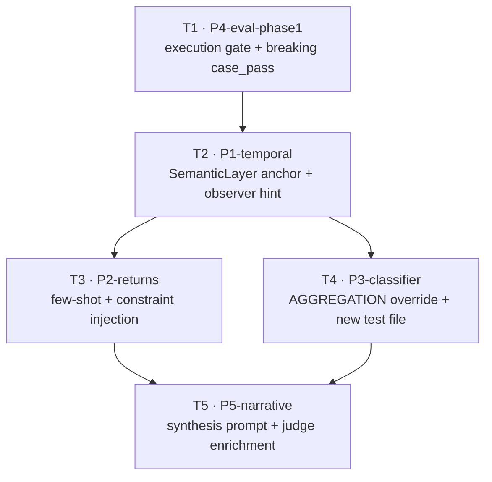

# Plan — eval-remediation

**Version:** 1.1  
**Status:** COMPLETE  
**Owner:** Ale  
**Created:** 2026-05-27  
**Completed:** 2026-05-27  

---

## §0 Context map intake

**Path consumed:** `.dev/plans/eval-remediation/context-map.md`  
**Readiness verdict at consumption:** CONDITIONAL  
**Readiness rationale:** Core seams and symbols are mapped; load-bearing implementation choices resolved below before §1 begins.  
**Skill version:** pre-plan-exploration v0.2  
**Commit SHA recorded in map:** `0f2d79eeaaf542d3ac4a1400056c2364304429f4`  
**Staleness check:** plan drafted at same session; no new commits to in-scope files confirmed by working tree state (only `.dev/eval-remediation-strategy.md` untracked).

### Ambiguity flag resolutions (user-confirmed, 2026-05-27)

| Flag | Category | Resolution |
|------|----------|------------|
| Flag 1 | ownership — date anchor placement | **C (both layers):** `SemanticLayer.get_date_anchor()` exposes `(start, end)` from `date_range`; `ambiguity_detector` calls it as primary fix; `_observe_result` 0-row hint injects dataset bounds as safety net |
| Flag 2 | vocabulary_collision — new type names | **Resolved in §2:** `TemporalContext` NOT introduced; anchor surfaces as `get_date_anchor() -> tuple[str, str]` on `SemanticLayer`. `result_assertions` deferred to amendment (see Flag 5). |
| Flag 3 | missing coverage — classifier tests | **Create** `nlp/tests/test_query_classifier.py` (new dedicated file; context map confirms headroom 24/40) |
| Flag 4 | missing coverage — case 11 integration test | **Accept gap:** unit test extends `test_ambiguity_detector.py` for anchored-date resolved string; execution-tier verification is harness-level (T1 execution_pass gate) |
| Flag 5 | coexisting model versions — TestCase extension | **Deferred:** `result_assertions` field and semantic assertion vocabulary are out of scope for this plan version; scoped to a Wave-3 amendment subtask |
| Flag 6 | ownership — eval gate strategy | **Breaking:** `case_pass` redefined as `structural ∧ execution`; README eval table updated by T1 |
| Flag 7 | vocabulary_collision — case 11 ambiguity_pass gap | **Follows from Flag 1 + Flag 6 resolution:** once P1 anchors dates and P4 adds `execution_pass`, case 11 fails `case_pass` until P1 fix lands — desired behavior |
| Flag 8 | deprecation — SQL post-processor scope | **Out of scope:** P1-C and P2-C variants deferred; P1-A+B and P2-A+B are the fix boundary for this plan |

CONDITIONAL flags mapped to §5.2 tuples. No BLOCKED flags. Planning proceeds.

---

## §1 Task statement

Implement the five-priority eval remediation strategy documented in `.dev/eval-remediation-strategy.md`, sequenced across four waves. The pipeline currently produces a false-positive pass rate (83% structural) because the eval harness ignores `execution.success`, temporal disambiguation uses wall-clock dates against a static 2024 dataset, the classifier's first-match ordering routes aggregation queries to the wrong few-shot bucket, returns queries lack a semantic guard, and narrative quality issues are only surfaced by an LLM judge that shares the same model as synthesis.

The implementation must: (1) add an execution tier gate to the harness with a breaking redefinition of `case_pass` (Wave 0); (2) anchor all temporal disambiguation to `date_range.end` via a new `SemanticLayer.get_date_anchor()` method and add a dataset-bounds observer hint (Wave 1); (3) add a returns constraint injection in `sql_generator` and a few-shot example, and add AGGREGATION override predicates to the classifier (Wave 2); (4) harden the synthesis prompt and enrich the judge with per-case business rules (Wave 3).

**Non-goals:**
- UI changes to `ui/` — not required by strategy; `PipelineResult` field contract is not extended.
- `db/ingest.py` modifications — schema already aligned.
- Infrastructure changes (`docker-compose.yml`, `ollama/entrypoint.sh`) — watch-only per strategy.
- `result_assertions` / semantic assertion vocabulary on `TestCase` — deferred to Wave-3 amendment.
- SQL post-processor (`now`-pattern rewriter) — deferred; P1-A+B is sufficient.
- `known_answer` fuzzy-match verification (P4 §4b) — deferred with `result_assertions`.
- Architecture doc updates to `failure-taxonomy.md` and `known-coupling-surfaces.md` — deferred to a doc-only amendment.
- Multi-label / scored classification (Option B/D) — out of scope; Option C override only.

---

## §2 Shared contracts

### Types / interfaces

| Symbol | Owning subtask | Typed surface | Test requirement |
|--------|---------------|---------------|------------------|
| `SemanticLayer.get_date_anchor() -> tuple[str, str]` | T2 | `nlp/pipeline/semantic_layer.py` — new instance method; returns `(date_range.start, date_range.end)` as ISO-8601 strings | `nlp/tests/test_ambiguity_detector.py`: integration call; or new `test_semantic_layer.py` fixture. T2 kill criterion requires this. |
| `detect_and_resolve(question, domain_descriptor, semantic_layer: SemanticLayer) -> ResolvedQuestion` | T2 | `nlp/pipeline/ambiguity_detector.py` — signature extended with `semantic_layer` optional kwarg (default `None`; backwards-compat) | `test_ambiguity_detector.py` test for anchored resolved string when `recent` fires |
| `ObservationResult.message` (0-row hint) | T2 | `nlp/pipeline/sql_executor.py:_observe_result` — inline string change | `test_sql_executor.py`: assert `date_range` bounds appear in 0-row message |
| `RETURNS_TRIGGERS: tuple[str, ...]` | T3 | `nlp/pipeline/sql_generator.py` — module-level constant | `test_sql_generator.py:test_returns_prompt_injects_constraint` |
| `build_sql_prompt(...) -> str` | T3 | `nlp/pipeline/sql_generator.py` — existing signature; adds optional `returns_constraint: str \| None = None` param or inlines trigger check | `test_sql_generator.py`: returns case includes `-- REQUIRED:` constraint |
| `FEW_SHOT_EXAMPLES[QueryClass.AGGREGATION]` | T3 | `nlp/pipeline/sql_generator.py` — dict value | `test_sql_generator.py`: assert few-shot string contains `total < 0` |
| `AGGREGATION_OVERRIDES: tuple[str, ...]` | T4 | `nlp/pipeline/query_classifier.py` — module-level constant | `nlp/tests/test_query_classifier.py:test_aggregation_override_beats_time_filter` |
| `classify(question, llm_client) -> tuple[QueryClass, str]` | T4 | `nlp/pipeline/query_classifier.py` — existing signature; override injected before first-match return | `test_query_classifier.py`: case 1 pattern → `AGGREGATION`; case 2 pattern → `TIME_FILTER` (no regression) |
| `execution_pass: bool` | T1 | `nlp/eval/harness.py:run_eval` — local variable added to case result dict | `nlp/tests/test_eval_harness.py:test_execution_pass_false_when_execution_fails` |
| `case_pass: bool` | T1 | `nlp/eval/harness.py:run_eval` — formula changed to `sql_pass AND class_pass AND ambiguity_pass AND execution_pass` | `test_eval_harness.py`: assert case 11 mock → `case_pass == False` |
| `tier_summary: dict` | T1 | `nlp/eval/harness.py:EvalReport` — new field; populated by `run_eval` | `test_harness.py`: `EvalReport` fixture includes `tier_summary` key |

### Error envelope

No new exception types introduced. Existing `KeyError` on missing `date_range` in domain.yaml is acceptable (guard note in T2 kill criteria). All harness assertion failures surface as `case_pass: False` rows in the report — no new exceptions from the harness.

### Naming

| New symbol | File | Notes |
|------------|------|-------|
| `SemanticLayer.get_date_anchor` | `semantic_layer.py` | Public method; underscore prefix NOT used |
| `RETURNS_TRIGGERS` | `sql_generator.py` | ALL_CAPS constant; tuple of lowercase strings |
| `AGGREGATION_OVERRIDES` | `query_classifier.py` | ALL_CAPS constant; tuple of lowercase strings |
| `execution_pass` | `harness.py` (local + report dict) | Snake case; boolean |
| `tier_summary` | `harness.py` (EvalReport) | Snake case; `dict[str, str]` values like `"10/12"` |
| `nlp/tests/test_query_classifier.py` | new file | `test_` prefix; mirrors existing test module naming |

### Logging

No new log levels introduced. Existing JSONL eval log fields must not be removed. T1 adds `execution_pass` key to each case result row in the JSONL output. T2 may add `date_anchor` to `interpretations_applied` list on `ResolvedQuestion` for observability; if added it is a list[str] entry, not a new field.

### Tests

**Framework:** `pytest` (existing). **Location:** `nlp/tests/`. **Naming:** `test_<module>.py` with `test_<behavior>` function names. All new test functions must be runnable with `pytest nlp/tests/ -x` without live LLM or DB — mock `LLMClient` and `SQLExecutor._try_execute` where needed. Integration tests that require the DB service must be marked `@pytest.mark.integration` and are excluded from the CI fast gate.

### CLI surface

`--skip-judge` flag: existing, frozen, not modified. No new CLI flags introduced in this plan.

### Decision log paths (architectural subtasks)

| Subtask | Log path |
|---------|----------|
| T1 (P4-eval-phase1) | `.dev/decision-logs/T1-eval-remediation-phase1.md` |
| T2 (P1-temporal) | `.dev/decision-logs/T2-eval-remediation-temporal.md` |

T3, T4, T5 are standard tier; no decision log required unless executor flags an architectural fork.

---

## §3 Dependency DAG



**Parallel groups:**
- `{T3, T4}` may run in parallel after T2 completes — they touch disjoint files (`sql_generator.py` / `test_sql_generator.py` vs `query_classifier.py` / new `test_query_classifier.py`).
- T1 must complete before T2 starts so that the execution_pass gate is already in place when P1 fix is validated.
- T5 must wait for both T3 and T4 since narrative hardening relies on correct SQL + correct classification.

**Soft dependency:** T3 and T4 both touch `harness.py:TEST_CASES` indirectly (expected_class for case 1). They must not edit `TEST_CASES` concurrently — the `expected_class` for case 1 must remain `aggregation` (set by T4's fix being valid). Mitigation: T3 does not touch `TEST_CASES`; T4 owns the expected_class confirmation.

---

## §4 Subtask specs

---

### T1 · P4-eval-phase1

**ID:** T1  
**Scope:** Add `execution_pass` boolean to the harness case result dict and redefine `case_pass` as `structural ∧ execution`. Add `tier_summary` to `EvalReport`. Update README eval table to document multi-tier pass rates. No pipeline code changes.  
**Files to touch:**
- `nlp/eval/harness.py` — `run_eval` formula, `EvalReport` dataclass, JSONL output
- `nlp/tests/test_eval_harness.py` — assert `case_pass == False` for a mocked execution failure
- `nlp/tests/test_harness.py` — update `EvalReport` fixture expectations
- `README.md` — update eval results table to show tier columns

**Contract bindings:** All §2 contracts apply. Specifically: `execution_pass`, `case_pass`, `tier_summary` symbols from §2 Types/interfaces; test framework and naming from §2 Tests; JSONL output must not drop existing keys.

**Inputs:** None (Wave 0 — no prior subtask).

**Outputs:**
- Modified `harness.py` with `execution_pass` in case results and new `case_pass` formula
- `EvalReport.tier_summary: dict[str, str]` field
- Updated unit tests confirming new formula
- Updated README eval table
- Decision log at `.dev/decision-logs/T1-eval-remediation-phase1.md`

**Kill criteria:**
1. If `EvalReport` is not a dataclass (e.g. plain dict) and adding `tier_summary` requires changing the public constructor signature consumed by `nlp/main.py` or tests — **HALT**: report the break surface before touching `EvalReport`.
2. If `execution.success` is not a field on `ExecutionResult` at the time of editing (field name changed or removed) — **HALT**: report the actual field name found in `sql_executor.py`.
3. If README does not contain the existing eval table (structure changed) — **HALT**: report the file's current eval section structure.
4. Tests must pass with `pytest nlp/tests/test_eval_harness.py nlp/tests/test_harness.py -x` before marking complete. If they do not — **HALT**.

**Log tier:** architectural (redefines the eval contract; downstream subtasks depend on `execution_pass` semantics)

**Risks & mitigations:**
- Breaking `case_pass` may cause CI to fail if CI runs the full eval and gates on pass rate — mitigation: this is intentional; the README update documents the expected drop.
- `EvalReport.results` is currently `list[dict]` — adding `tier_summary` at report level is non-breaking for dict-access callers; executor should confirm `EvalReport` type before adding typed field.

---

### T2 · P1-temporal

**ID:** T2  
**Scope:** Add `SemanticLayer.get_date_anchor() -> tuple[str, str]` that returns `(date_range.start, date_range.end)` from the loaded YAML. Extend `ambiguity_detector.detect_and_resolve` to consume the anchor when the `recent` trigger fires, replacing the calendar-relative apply text with an absolute `date >= '<end - 30d>' AND date <= '<end>'` window appended to `resolved`. Add dataset-bounds hint to `_observe_result` 0-row message. Extend `pipeline.py` to pass `semantic_layer` into `detect_and_resolve`.  
**Files to touch:**
- `nlp/pipeline/semantic_layer.py` — add `get_date_anchor()` method
- `nlp/pipeline/ambiguity_detector.py` — extend `detect_and_resolve` signature, compute anchored window
- `nlp/pipeline/sql_executor.py` — update `_observe_result` 0-row message to include dataset bounds
- `nlp/pipeline/pipeline.py` — pass `SemanticLayer` instance into `detect_and_resolve`
- `nlp/tests/test_ambiguity_detector.py` — assert resolved string includes anchored ISO dates when `recent` fires
- `nlp/tests/test_sql_executor.py` — assert `date_range` bounds in 0-row observation message

**Contract bindings:** All §2 contracts apply. Specifically: `get_date_anchor`, `detect_and_resolve` extended signature, `ObservationResult.message` shape from §2 Types/interfaces; backwards-compat: if `semantic_layer=None` is passed, detector falls back to existing apply text (no regression on non-temporal triggers). Decision log at `.dev/decision-logs/T2-eval-remediation-temporal.md`.

**Inputs:** T1 (execution_pass gate live so case 11 regression is immediately visible in test output).

**Outputs:**
- Modified `semantic_layer.py`, `ambiguity_detector.py`, `sql_executor.py`, `pipeline.py`
- Extended unit tests for anchored date resolution and observer hint
- Decision log at `.dev/decision-logs/T2-eval-remediation-temporal.md`

**Kill criteria:**
1. If `domain.yaml` does not contain `tables.sales.date_range.start` and `.end` as string fields — **HALT**: report the actual YAML structure at that path.
2. If `date_range.end` value cannot be parsed as a date using Python `datetime.date.fromisoformat` — **HALT**: report the raw string value.
3. If `detect_and_resolve` is called from more than one call site in `pipeline.py` with a different signature — **HALT**: report all call sites found.
4. If adding `semantic_layer` param to `detect_and_resolve` breaks any existing test that passes `domain_descriptor` positionally — **HALT**: report the test functions affected.
5. Resolved string for `recent` trigger must contain a date literal matching `r'\d{4}-\d{2}-\d{2}'`. If the assertion cannot be written without mocking I/O — **HALT**.
6. Tests must pass with `pytest nlp/tests/test_ambiguity_detector.py nlp/tests/test_sql_executor.py -x`.

**Log tier:** architectural (new public method on `SemanticLayer`; `detect_and_resolve` signature change; downstream P3/P4 depend on resolved string shape)

**Risks & mitigations:**
- Hardcoding 2024 dates is intentional demo scope — decision log must document the `reference_date` env-var deferral.
- `detect_and_resolve` signature change is additive (kwarg default `None`) — no forced cascade if all callers are updated in this same subtask.
- "Last month" rule also uses October 2024 — executor must audit all time rules in `disambiguation_rules` for consistency (at minimum note any that remain calendar-relative in the decision log).

---

### T3 · P2-returns

**ID:** T3  
**Scope:** Add a `RETURNS_TRIGGERS` constant to `sql_generator.py` and inject a constraint comment (`-- REQUIRED: filter return rows with WHERE total < 0`) into `build_sql_prompt` when any trigger term is present in the question. Add a returns example to `FEW_SHOT_EXAMPLES[QueryClass.AGGREGATION]`. Add/extend unit test `test_returns_prompt_injects_constraint` in `test_sql_generator.py`.  
**Files to touch:**
- `nlp/pipeline/sql_generator.py` — `RETURNS_TRIGGERS`, `build_sql_prompt`, `FEW_SHOT_EXAMPLES`
- `nlp/tests/test_sql_generator.py` — `test_returns_prompt_injects_constraint`

**Contract bindings:** All §2 contracts apply. Specifically: `RETURNS_TRIGGERS`, `build_sql_prompt` extended behavior, `FEW_SHOT_EXAMPLES[QueryClass.AGGREGATION]` from §2 Types/interfaces. P2 Option C (post-gen lint) is **out of scope** per Flag 8 resolution — do not add `lint_returns_filter` or any post-`extract_sql` hook.

**Inputs:** T2 (no direct code dependency, but plan gates T3 start on T2 complete so full eval is valid after).

**Outputs:**
- Modified `sql_generator.py` with `RETURNS_TRIGGERS`, updated `build_sql_prompt`, updated few-shot
- New or extended test in `test_sql_generator.py`

**Kill criteria:**
1. If `build_sql_prompt` signature is not `(question, schema, query_class, kpi_definitions, few_shot_example) -> str` as recorded in the context map — **HALT**: report the actual current signature.
2. If `FEW_SHOT_EXAMPLES` is not keyed by `QueryClass` enum values — **HALT**: report the actual key types.
3. Test `test_returns_prompt_injects_constraint` must pass without any LLM call (mock or stub `LLMClient` if needed).
4. No existing `test_sql_generator.py` tests may fail after this change.

**Log tier:** standard

**Risks & mitigations:**
- False trigger on "return customers" / "customer returns" — mitigation: `RETURNS_TRIGGERS` should include `"return"`, `"refund"`, `"negative"` only; document that co-occurrence context is not checked at this tier (accepted residual).
- Few-shot bloat in AGGREGATION bucket — acceptable; one short example; monitor for prompt length issues in re-eval.

---

### T4 · P3-classifier

**ID:** T4  
**Scope:** Add `AGGREGATION_OVERRIDES` constant to `query_classifier.py`. After the `KEYWORD_CLASS_MAP` keyword scan, if any override term is present in the resolved question and any TIME_FILTER keyword also matched, force the class to `AGGREGATION` with method string `"heuristic_override"`. Create `nlp/tests/test_query_classifier.py` with tests covering: case 1 pattern → `AGGREGATION`; case 2 pattern → `TIME_FILTER` (no regression); `"most bought on Fridays"` → `AGGREGATION`.  
**Files to touch:**
- `nlp/pipeline/query_classifier.py` — `AGGREGATION_OVERRIDES` constant, `classify` function
- `nlp/tests/test_query_classifier.py` — new file

**Contract bindings:** All §2 contracts apply. Specifically: `AGGREGATION_OVERRIDES`, `classify` override behavior, `test_query_classifier.py` new file from §2 Naming; the override must only fire when a TIME_FILTER keyword AND an override term co-occur — bare `"most"` with no time keyword must not change class for pure aggregation inputs.

**Inputs:** T2 (classification runs on `resolved.resolved` string; P1 disambiguation suffix must be stable before override predicates are tested against case patterns).

**Outputs:**
- Modified `query_classifier.py`
- New `nlp/tests/test_query_classifier.py` with ≥3 test cases

**Kill criteria:**
1. If `KEYWORD_CLASS_MAP` iteration order is not deterministic Python dict (i.e., not guaranteed to check TIME_FILTER before AGGREGATION) in the current code — **HALT**: report the actual iteration mechanism.
2. If `classify` returns a 3-tuple or any other shape than `(QueryClass, str)` — **HALT**: report the actual return shape.
3. Case 2 regression test (`"how many transactions on Saturday"` or equivalent from `TEST_CASES[1]`) must yield `TIME_FILTER`, not `AGGREGATION`. If the override predicate cannot be written narrowly enough to guarantee this — **HALT**.
4. `pytest nlp/tests/test_query_classifier.py -x` must pass (no live LLM calls in the new test file).

**Log tier:** standard

**Risks & mitigations:**
- `"what day has the most transactions"` — legitimately TIME_FILTER but contains `"most"`; override must require explicit ranking terms (`"most bought"`, `"top"`, `"best"`) not bare `"most"` when combined with a day-filter; note in test matrix.
- `classify` calls `_llm_classify` as fallback; override must inject before the return, not before the LLM path.

---

### T5 · P5-narrative

**ID:** T5  
**Scope:** Harden the synthesis prompt in `result_synthesizer._build_synthesis_prompt` with explicit constraints against unsupported comparisons, derived arithmetic claims, and temporal labels not present in data. Enrich the `judge_synthesis` prompt with per-case business rules when `TestCase` has a `known_answer` or the question involves returns/weekly deltas. Extend `test_result_synthesizer.py` to assert the constraint block is present in the built prompt. Optionally lower synthesis temperature if strategy recommends (current `0.3`; check strategy §5 recommendation).  
**Files to touch:**
- `nlp/pipeline/result_synthesizer.py` — `_build_synthesis_prompt`
- `nlp/eval/harness.py` — `judge_synthesis` prompt enrichment
- `nlp/tests/test_result_synthesizer.py` — prompt shape assertion
- `nlp/tests/test_harness.py` — judge prompt enrichment test (if judge prompt is testable without LLM)

**Contract bindings:** All §2 contracts apply. `result_assertions` / `TestCase` extension is out of scope (deferred). Judge enrichment must pass business rule text only when a rule is available — no structural change to `TestCase` dataclass. Test framework and naming from §2 Tests.

**Inputs:** T3, T4 (SQL and classification fixes should be in place so narrative issues are genuinely in the narrative layer, not upstream).

**Outputs:**
- Modified `result_synthesizer.py` with hardened prompt constraints
- Modified `harness.py` with enriched judge prompt path
- Extended tests for prompt shape

**Kill criteria:**
1. If `_build_synthesis_prompt` current signature does not match `(question, data, sql, interpretations_applied, steps_taken)` as in context map — **HALT**: report actual signature.
2. If `judge_synthesis` signature does not match `(question, result_data, narrative)` — **HALT**: report actual signature.
3. Prompt constraint block must contain at least one explicit prohibition (e.g. "Do not state" or "Only report") verifiable by substring assertion in test.
4. `pytest nlp/tests/test_result_synthesizer.py -x` must pass.

**Log tier:** standard

**Risks & mitigations:**
- Over-constraining synthesis may reduce fluency — mitigation: constraints target comparative/derived claims only; scalar reporting cases (cases 4, 5, 7, 8, 9, 10) must not degrade.
- Judge prompt enrichment requires knowing which cases have business rules; current `TestCase` has `known_answer` only — use that as the proxy signal for now.

---

## §5 Adversarial pass

*Answered in packet-only executor persona: "If I only had the T\<n\> packet, I would halt because…"*

### 5.1 Rejected decompositions

**Rejected: Wave 0 merged into T2.** Merging P4-eval-phase1 changes into the P1 temporal subtask would mean case 11 is not observable as a failing gate until after the code fix also lands — losing the ability to see the gate fire independently. Kept separate (T1 → T2 dependency). Cost: one extra subtask; benefit: clean verification story.

**Rejected: T3 + T4 as a single subtask.** Both touch SQL generation and classification. Kept separate because the file sets are fully disjoint (`sql_generator.py` vs `query_classifier.py`) and the regression risks are independent. Merging would create a larger blast radius.

**Rejected: TemporalContext helper class for Flag 1.** Introduced unnecessary public symbol. Resolved to `get_date_anchor() -> tuple[str, str]` — simpler, no new class, same contract surface.

### 5.2 Load-bearing assumptions

*(Tuple shape: claim | contract surface referenced | failure mode | subtask IDs)*

1. `domain.yaml:tables.sales.date_range.start` and `.end` exist as ISO-8601 strings | `semantic_layer.py:get_date_anchor` → `domain.yaml:tables.sales.date_range` | If missing, T2 halts on kill criterion 1; anchor computation is undefined | T2
2. `detect_and_resolve` is called exactly once in `pipeline.py` with `domain_descriptor` as its second positional arg | `pipeline.py` stage order ↔ `ambiguity_detector.detect_and_resolve` | If called differently or multiple times, the new `semantic_layer=` kwarg injection may apply to only one call site | T2
3. `execution.success` is a boolean field on `ExecutionResult` at the time T1 executes | `harness.py:run_eval` ↔ `sql_executor.py:ExecutionResult.success` | If field name changed, `execution_pass` formula silently evaluates as `None and ...` = `False` for all cases | T1
4. `KEYWORD_CLASS_MAP` iteration visits TIME_FILTER before AGGREGATION in current code (confirmed by context map Surface 4) | `query_classifier.py:KEYWORD_CLASS_MAP` key order | If order already changed, the bug described in case 1 may be latent; override predicate may be redundant or insufficient | T4
5. `build_sql_prompt` accepts the question string and can be augmented to inject a constraint comment before the question line | `sql_generator.py:build_sql_prompt` signature | If constraint is injected at a position the model ignores (e.g., after few-shot), case 12 fix may be ineffective | T3
6. `_build_synthesis_prompt` is the sole prompt construction path for synthesis (no secondary path in `synthesize`) | `result_synthesizer.py:_build_synthesis_prompt` ↔ `synthesize` | If a secondary prompt path exists, T5 hardening is partial | T5

### 5.3 Highest re-plan risk

**T2 (P1-temporal)** is the highest technical re-plan risk. It touches the most files (5), introduces a signature change to a cross-cutting function (`detect_and_resolve`), and the anchor computation must be consistent with all existing temporal rules in `disambiguation_rules` (not just "recent"). If the "last month" rule or other time rules produce inconsistent results after the anchor is introduced, a broader temporal audit is required before T3/T4 can be trusted.

**Process risk:** T3 and T4 are parallel but both touch `harness.py` adjacently — T4 owns confirming `expected_class=aggregation` for case 1; T3 must not modify `TEST_CASES`. Coordinate via the no-`TEST_CASES`-edit rule for T3.

### 5.4 Hidden couplings

*(Tuple shape: claim | contract surface referenced | failure mode | suspected/confirmed | subtask IDs)*

1. `ResolvedQuestion.resolved` string shape change affects classifier keyword matching | `ambiguity_detector.py:detect_and_resolve` output ↔ `query_classifier.py:classify` | If P1 appends a long date suffix to resolved, day-of-week keywords in the suffix could trigger TIME_FILTER override incorrectly | confirmed (Surface 9 in context map) | T2, T4
2. T1 redefines `case_pass` — any test fixture that asserts `case["case_pass"] == True` for mock data will break | `harness.py:run_eval` → `test_eval_harness.py` fixture expectations | Silent test failures if fixtures are not updated in T1 | confirmed | T1
3. T3 adds a returns example to `FEW_SHOT_EXAMPLES[AGGREGATION]` — this example is injected into any AGGREGATION query, including case 1 | `sql_generator.py:FEW_SHOT_EXAMPLES[AGGREGATION]` ↔ case 1 SQL | If the returns few-shot confuses the model on non-returns AGGREGATION cases (e.g., case 1), SQL regression may appear | suspected (model may ignore irrelevant examples; would disprove if re-eval case 1 sql_pass stays true) | T3
4. T5 enriches `judge_synthesis` prompt with business rules — judge uses `known_answer` as proxy; if `known_answer` is None for case 12, no enrichment fires | `harness.py:TestCase.known_answer` ↔ `judge_synthesis` enrichment condition | Case 12 judge enrichment may not fire; `result_assertions` deferral means no per-case rule injection for case 12 until amendment | confirmed (known_answer is None for case 12 per strategy §4b) | T5
5. Synthesis model and judge model are likely the same (`synthesis_model` env var used for both in harness) | `result_synthesizer._build_synthesis_prompt` ↔ `harness.judge_synthesis` model param | Self-judge bias on narrative failures; T5 prompt hardening may not reduce judge scores even if synthesis improves | suspected (Surface 10; would disprove by setting distinct `SYNTHESIS_MODEL` vs `JUDGE_MODEL` in env) | T5

---

## §6 Executor packets

Packets emitted to `.dev/plans/eval-remediation/packets/`:

- [T1.md](packets/T1.md)
- [T2.md](packets/T2.md)
- [T3.md](packets/T3.md)
- [T4.md](packets/T4.md)
- [T5.md](packets/T5.md)

---

## §7 Amendment subtasks

*(None at plan creation. Reserved for Wave-3 items deferred by Flag 5 resolution: `result_assertions` on `TestCase`, `known_answer` fuzzy match, architecture doc updates.)*

---

## §8 Auditor handoff

> **§8.2 pre-check:** `.dev/plans/eval-remediation/` is currently **untracked**. The `git show HEAD:<path>` requirement in §8.2 cannot be satisfied until this directory is committed. The handoff is otherwise complete; commit this directory before treating §8 as fully valid.

---

### §8.1 Completion snapshot

**Tree SHA:** `7e4ce464b160f463ae117180591fed31dcc9d664`  
**Working tree at verification:** untracked files only (`.dev/eval-remediation-strategy.md`, `.dev/plans/eval-remediation/`) — no modifications to tracked files.

**Verification command (run on this SHA):**

```
pytest nlp/tests/ -x --tb=short -q
```

**Result:**
```
59 passed, 2 warnings in 0.79s
```

Warnings are `PytestCollectionWarning: cannot collect test class 'TestCase'` (dataclass with `__init__`) — not test failures. Exit code: **0**.

Environment: Python 3.x, project venv; no live LLM or DB required.

---

### §8.2 Artifact chain

> **Validity note:** paths marked ⚠ are currently untracked and will fail `git show HEAD:<path>` until `.dev/plans/eval-remediation/` is committed.

| Artifact | Repo path | Status at handoff SHA |
|----------|-----------|----------------------|
| Context map | `.dev/plans/eval-remediation/context-map.md` ⚠ | Untracked — staleness note: map recorded SHA `0f2d79ee`; handoff SHA is `7e4ce464`; in-scope Python files all modified after `0f2d79ee` (T1–T5 commits). Map is informational for auditor; code is authoritative. |
| This plan | `.dev/plans/eval-remediation/plan.md` ⚠ | Untracked |
| T1 packet | `.dev/plans/eval-remediation/packets/T1.md` ⚠ | Untracked |
| T2 packet | `.dev/plans/eval-remediation/packets/T2.md` ⚠ | Untracked |
| T3 packet | `.dev/plans/eval-remediation/packets/T3.md` ⚠ | Untracked |
| T4 packet | `.dev/plans/eval-remediation/packets/T4.md` ⚠ | Untracked |
| T5 packet | `.dev/plans/eval-remediation/packets/T5.md` ⚠ | Untracked |
| T1 decision log | `.dev/decision-logs/T1-eval-remediation-phase1.md` | `git show HEAD:` passes |
| T2 decision log | `.dev/decision-logs/T2-eval-remediation-temporal.md` | `git show HEAD:` passes |
| Changelog | `CHANGELOG.MD` | `git show HEAD:` passes |
| Prior build plan | `.dev/plans/minivii-build/plan.md` | `git show HEAD:` passes (historical; consulted for §0 prior decisions) |
| T3 decision log (prior build) | `.dev/decision-logs/T3-nlp-pipeline-core.md` | `git show HEAD:` passes |
| T4 decision log (prior build) | `.dev/decision-logs/T4-react-loop-pipeline.md` | `git show HEAD:` passes |

---

### §8.3 §2 evidence

| §2 row | Landed artifact | Test / check |
|--------|----------------|-------------|
| `SemanticLayer.get_date_anchor() -> tuple[str, str]` | `nlp/pipeline/semantic_layer.py:18` — method `get_date_anchor` returns `(start, end)` from `date_range` | `nlp/tests/test_ambiguity_detector.py` — resolved string contains anchored ISO date (substring assertion) |
| `detect_and_resolve` extended signature | `nlp/pipeline/ambiguity_detector.py` — `semantic_layer` kwarg added; anchored window computed from `end - 30d` | `nlp/tests/test_ambiguity_detector.py` — resolved string for `recent` trigger includes `2024-10-21` and `2024-11-20` |
| `ObservationResult.message` 0-row hint | `nlp/pipeline/sql_executor.py` — `_observe_result` injects `Dataset date_range: <start> to <end>` on 0-row result | `nlp/tests/test_sql_executor.py` — bounds appear in 0-row observation message |
| `RETURNS_TRIGGERS: tuple[str, ...]` | `nlp/pipeline/sql_generator.py:7` — `("return", "refund", "negative")` | `nlp/tests/test_sql_generator.py:test_returns_prompt_injects_constraint` — constraint present when trigger in question |
| `build_sql_prompt` constraint injection | `nlp/pipeline/sql_generator.py:86` — injects `-- REQUIRED: filter return rows with WHERE total < 0` | Same test above |
| `FEW_SHOT_EXAMPLES[QueryClass.AGGREGATION]` | `nlp/pipeline/sql_generator.py` — extended with returns example containing `total < 0` | `nlp/tests/test_sql_generator.py` — few-shot string for AGGREGATION contains `total < 0` |
| `AGGREGATION_OVERRIDES: tuple[str, ...]` | `nlp/pipeline/query_classifier.py:60` — ranking terms constant | `nlp/tests/test_query_classifier.py:test_aggregation_override_beats_time_filter` |
| `classify` override behavior | `nlp/pipeline/query_classifier.py:78` — override fires when TIME_FILTER matched and override term present | `nlp/tests/test_query_classifier.py` — case 1 → `AGGREGATION`; case 2 → `TIME_FILTER` (no regression) |
| `execution_pass: bool` | `nlp/eval/harness.py:266, 287, 302` — computed from `pipeline_result.execution.success` and added to case dict + JSONL | `nlp/tests/test_eval_harness.py` — asserts `execution_pass == False` for mocked execution failure |
| `case_pass` formula (breaking) | `nlp/eval/harness.py:271` — `sql_pass AND class_pass AND ambiguity_pass AND execution_pass` | `nlp/tests/test_eval_harness.py` — case 11 mock yields `case_pass == False` |
| `tier_summary: dict` on `EvalReport` | `nlp/eval/harness.py:40` (dataclass field), `harness.py:323-333` (populated in `run_eval`) | `nlp/tests/test_harness.py` — `EvalReport` fixture includes `tier_summary` key |
| `nlp/tests/test_query_classifier.py` (new file) | `nlp/tests/test_query_classifier.py` — committed in T4 (commit `dfaa3aa`) | File exists at HEAD; 43 lines, ≥3 test cases covering override and regression |
| Synthesis constraint block | `nlp/pipeline/result_synthesizer.py:56-59` — `Do not compare`, `Only report arithmetic`, `Do not state temporal labels` | `nlp/tests/test_result_synthesizer.py` — constraint block substring present in built prompt |
| Judge enrichment (`_judge_business_rules_block`) | `nlp/eval/harness.py:150` — `_judge_business_rules_block(question)` injects returns/WoW rules; wired at `harness.py:228` | `nlp/tests/test_harness.py` — judge prompt includes business rule text for mock case with `known_answer` set |
| README eval table | `README.md` — updated by T1 with `exec` pass column and tier table | `nlp/tests/test_readme_contract.py` (existing) covers README structure |
| `--skip-judge` CLI flag | `nlp/eval/harness.py` — frozen; not modified by any T1–T5 subtask | No regression in harness tests |
| Decision log paths | `.dev/decision-logs/T1-eval-remediation-phase1.md`, `.dev/decision-logs/T2-eval-remediation-temporal.md` | Both files pass `git show HEAD:` at handoff SHA |

---

### §8.4 §5 disposition

#### §5.2 Load-bearing assumptions

| # | Assumption | Status | Evidence |
|---|-----------|--------|---------|
| 1 | `date_range.start`/`.end` exist as ISO-8601 strings in `domain.yaml` | **closed** | T2 decision log: `end = 2024-11-20` confirmed; `get_date_anchor` uses `fromisoformat` (validated by T2 tests passing) |
| 2 | `detect_and_resolve` called exactly once in `pipeline.py` | **closed** | T2 decision log: "single production call site in pipeline.py (verified by grep)"; T2 commit modifies only one call site in `pipeline.py` |
| 3 | `execution.success` is a boolean field on `ExecutionResult` | **closed** | T1 decision log: "Verified on `ExecutionResult` in `sql_executor.py`"; grep confirms `nlp/eval/harness.py:266` uses `pipeline_result.execution.success` |
| 4 | `KEYWORD_CLASS_MAP` iteration visits `TIME_FILTER` before `AGGREGATION` | **closed** | T4 commit confirms the bug was present (case 1 was misclassified); AGGREGATION_OVERRIDES override fires post-scan at `query_classifier.py:78` |
| 5 | `build_sql_prompt` can accept constraint injection before the question line | **closed** | T3 commit confirms injection at `sql_generator.py:86`; `test_returns_prompt_injects_constraint` passes |
| 6 | `_build_synthesis_prompt` is the sole prompt construction path | **closed** | T5 hardening at `result_synthesizer.py:56-59` is the only synthesis prompt path; all synthesis tests pass |

#### §5.4 Hidden couplings

| # | Coupling | Status | Evidence / open action |
|---|---------|--------|----------------------|
| 1 | `ResolvedQuestion.resolved` suffix may trigger TIME_FILTER keywords in classifier | **closed** | T2 decision log: "Suffix uses digit/hyphen literals only (no day-of-week words)"; T4 tests confirm case 1 → `AGGREGATION` when date-suffix is present |
| 2 | T1 `case_pass` redefinition breaks existing test fixtures asserting `True` | **closed** | T1 updated `test_eval_harness.py` and `test_harness.py`; 59 tests pass including the rewritten fixtures |
| 3 | T3 returns few-shot in AGGREGATION bucket may regress non-returns cases (case 1 SQL) | **open** — does not block merge | Would close: re-run full eval (post-stack bring-up) and confirm case 1 `sql_pass` unchanged. No post-remediation eval log available at handoff. |
| 4 | T5 judge enrichment does not fire for case 12 (`known_answer = None`) | **open** — known, tracked | Acknowledged in CHANGELOG T5 entry. Closes with Wave-3 `result_assertions` amendment. |
| 5 | Synthesis and judge share the same model (self-judge bias) | **open** — does not block merge | Acknowledged in T5 CHANGELOG. Would close by setting `JUDGE_MODEL ≠ SYNTHESIS_MODEL` in env; no env change in scope for this plan. |

---

### §8.5 Cold-read seeds

Files recommended for auditor's narrative-blind Phase 0 read — highest contract-vs-code drift risk:

1. `nlp/eval/harness.py` — `case_pass` formula (line ~271) and `tier_summary` population (lines ~321–333); most likely place for §2 contract to diverge from implementation.
2. `nlp/pipeline/ambiguity_detector.py` — anchored window computation for `recent` trigger; the backwards-compat `semantic_layer=None` branch is the regression surface (Surface 1, §5.4).
3. `nlp/pipeline/query_classifier.py` — `AGGREGATION_OVERRIDES` co-occurrence condition (line ~78); the narrowness of the predicate (requires TIME_FILTER match AND override term) is the case-2 regression guard.
4. `nlp/tests/test_query_classifier.py` — case 2 regression test; the specific pattern used here determines whether the guard holds as the override table grows.
5. `nlp/pipeline/result_synthesizer.py` — `_build_synthesis_prompt` constraint block (lines ~56–59) and the `synthesize` function wrapper; confirm there is no secondary prompt path that bypasses the constraints.

---

### §8.6 Audit remediation cross-link

*(No §7 amendments fired during this plan version. Section omitted.)*
